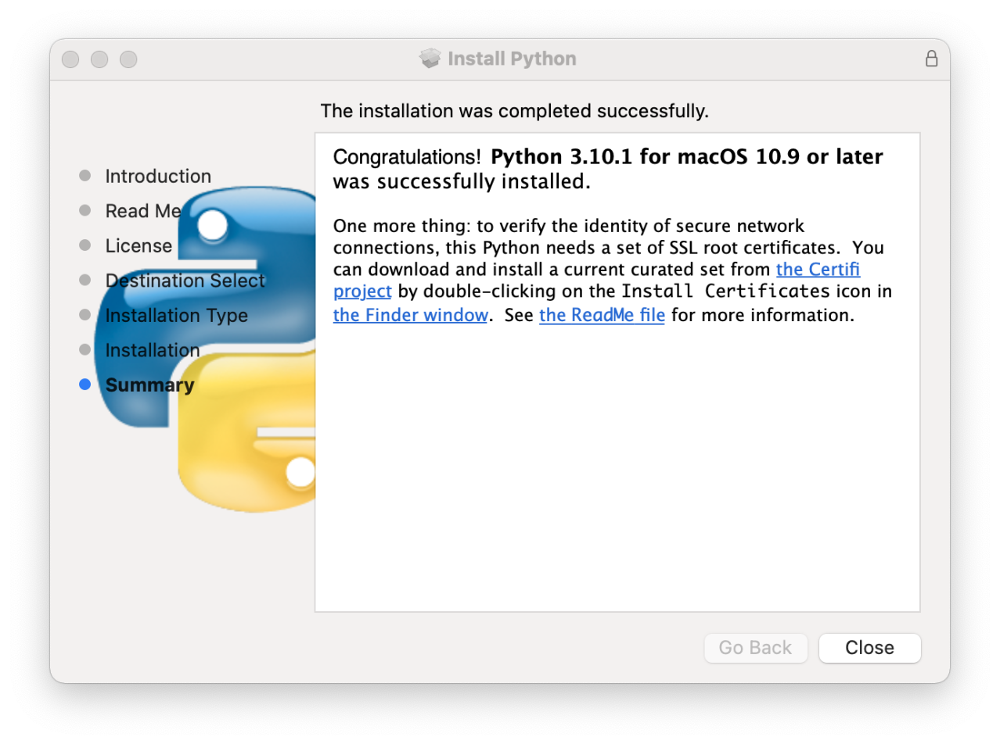

## Python installation


In older versions of the operating system (before Monterrey Version 12.3, early 2022),
an old system version of Python was installed:

```
$ /usr/bin/python -V
Python 2.7.18

$ /usr/bin/python

WARNING: Python 2.7 is not recommended.
This version is included in macOS for compatibility with legacy software.
Future versions of macOS will not include Python 2.7.
Instead, it is recommended that you transition to using 'python3' from within Terminal.

Python 2.7.18 (default, Jan  4 2022, 17:47:56)
[GCC Apple LLVM 13.0.0 (clang-1300.0.29.10) [+internal-os, ptrauth-isa=deployme on darwin
Type "help", "copyright", "credits" or "license" for more information.
>>> 
```

This was in fact a link to:

    /usr/bin/python@ -> ../../System/Library/Frameworks/Python.framework/Versions/2.7/bin/python2.7

Since this version of Python was only intended for use by the operating system, no `pip` command
associated with it.

As stated in the warning, newer versions of macOS do not include this Python 2.7 distribution.

In `/usr/bin` there is a `python3` command with a newer version of Python:

```
$ /usr/bin/python3 -V
Python 3.9.6

$ /usr/bin/python3
Python 3.9.6 (default, Dec  7 2023, 05:42:47)
[Clang 15.0.0 (clang-1500.1.0.2.5)] on darwin
Type "help", "copyright", "credits" or "license" for more information.
>>>
```

In the same location there is a `pip3` command associated with this version of Python:

```
$ /usr/bin/pip3 -V
pip 21.2.4 from /Applications/Xcode.app/Contents/Developer/Library/Frameworks/Python3.framework/Versions/3.9/lib/python3.9/site-packages/pip (python 3.9)
```

These pre-installed versions of Python are only intended for use by the operating system,
so they should not be used (and no packages should be installed using `pip3`).

Therefore, in order to use Python for software developement we need to
install other distributions of Python.

### PSF Python

In addition to system Python (not to be used) the first Python distribution to install
is that of the [PSF](https://www.python.org). For macOS we will select the
macOS 64-bit universal2 installer (`.dmg` file).

The installation is simple, and when completed you should see a window similar
to this one (depending on the version of Python and of the operating system):



This window includes a message that indicates that a set of SSL root certificates are required.
When clicking in the `Install Certificates` icon in a Finder window the following command 
will run:

```
$ ./Install\ Certificates.command
 -- pip install --upgrade certifi
Collecting certifi
  Downloading certifi-2021.10.8-py2.py3-none-any.whl (149 kB)
     |████████████████████████████████| 149 kB 4.2 MB/s
Installing collected packages: certifi
Successfully installed certifi-2021.10.8
WARNING: You are using pip version 21.2.4; however, version 21.3.1 is available.
You should consider upgrading via the '/Library/Frameworks/Python.framework/Versions/3.10/bin/python3.10 -m pip install --upgrade pip' command.
 -- removing any existing file or link
 -- creating symlink to certifi certificate bundle
 -- setting permissions
 -- update complete

```

The PSF installation adds the following lines to your `.bash_profile`:

```
# Setting PATH for Python 3.12
PATH="/Library/Frameworks/Python.framework/Versions/3.12/bin:${PATH}"
export PATH
```

The resulting `$PATH` variable will look similar to:

```
/Library/Frameworks/Python.framework/Versions/3.12/bin:/opt/local/bin:/opt/local/sbin:/usr/local/bin:/usr/bin:/bin:/usr/sbin:/sbin:/opt/X11/bin
```

And now we have:

```
$ command -v python
/Library/Frameworks/Python.framework/Versions/3.12/bin/python

$ python
Python 3.12.1 (v3.12.1:2305ca5144, Dec  7 2023, 17:23:38) [Clang 13.0.0 (clang-1300.0.29.30)] on darwin
Type "help", "copyright", "credits" or "license" for more information.
>>>
```

In the most recent versions of macOS, after installing the PSF Python,
the commands `python` and `python3` are aliases to the current version (in this example `python3.12`).

### Upgrade `pip`

When installing the SSL root certificates we obtained a warning that
a newer version of `pip` was available. To install this new version run:
```
$ command -v pip
/Library/Frameworks/Python.framework/Versions/3.12/bin/pip

$ pip --version
pip 23.3.1 from /Library/Frameworks/Python.framework/Versions/3.12/lib/python3.12/site-packages/pip (python 3.12)

$ $ python -m pip install --upgrade pip
Requirement already satisfied: pip in /Library/Frameworks/Python.framework/Versions/3.12/lib/python3.12/site-packages (23.3.1)
Collecting pip
  Downloading pip-23.3.2-py3-none-any.whl.metadata (3.5 kB)
Downloading pip-23.3.2-py3-none-any.whl (2.1 MB)
   ━━━━━━━━━━━━━━━━━━━━━━━━━━━━━━━━━━━━━━━━ 2.1/2.1 MB 4.0 MB/s eta 0:00:00
Installing collected packages: pip
  Attempting uninstall: pip
    Found existing installation: pip 23.3.1
    Uninstalling pip-23.3.1:
      Successfully uninstalled pip-23.3.1
Successfully installed pip-23.3.2

$ pip --version
pip 23.3.2 from /Library/Frameworks/Python.framework/Versions/3.12/lib/python3.12/site-packages/pip (python 3.12)
```

In the folder where the `python` and `pip` commands are located 
(`/Library/Frameworks/Python.framework/Versions/3.12/bin`) we can find
`pip`, `pip3`, and `pip3.12`. All of them are identical Python scripts.

### Install Anaconda

Download the installer from the [Anaconda](https://www.anaconda.com/download) web site.
Select the apropriate version: Intel or M1/M2/M3.

After running the installer, the following lines are added to `.bash_profile`:

```
# >>> conda initialize >>>
# !! Contents within this block are managed by 'conda init' !!
__conda_setup="$('/Users/antonio/opt/anaconda3/bin/conda' 'shell.bash' 'hook' 2> /dev/null)"
if [ $? -eq 0 ]; then
    eval "$__conda_setup"
else
    if [ -f "/Users/antonio/opt/anaconda3/etc/profile.d/conda.sh" ]; then
        . "/Users/antonio/opt/anaconda3/etc/profile.d/conda.sh"
    else
        export PATH="/Users/antonio/opt/anaconda3/bin:$PATH"
    fi
fi
unset __conda_setup
# <<< conda initialize <<<
```

The variable `$PATH` now will look similar to:

```
/Users/antonio/opt/anaconda3/bin:/Users/antonio/opt/anaconda3/condabin:/Library/Frameworks/Python.framework/Versions/3.10/bin:/opt/local/bin:/opt/local/sbin:/usr/local/bin:/usr/bin:/bin:/usr/sbin:/sbin:/opt/X11/bin:/Library/Apple/usr/bin
```

With this configuration, each new shell or terminal will activate the Anaconda `base` environment.
To prevent the activation by default, run the following command:

    $ conda config --set auto_activate_base false

This creates a file named `.condarc` in the `$HOME` directory with the following line:

    auto_activate_base: false

Now, when opening a new shell the variable `$PATH` will look similar to:

```
/Users/antonio/opt/anaconda3/condabin:/Library/Frameworks/Python.framework/Versions/3.10/bin:/opt/local/bin:/opt/local/sbin:/usr/local/bin:/usr/bin:/bin:/usr/sbin:/sbin:/opt/X11/bin:/Library/Apple/usr/bin
```

After making these changes, if you want to activate the `base` environment type:

    $ conda activate [base]

Then the prompt will change to:

    (base) $

Periodically update `conda`:


### Install packages with pipx

For some Python packages we are only interested in the commands that they provide, and
we do not need to import their packages or modules. In this case, instead of manually creating
an specific environment for each package and installing it with `pip`, it is possible to
install it using `pipx`. Under the hood `pipx` creates an environment for each package
and makes the commands available via soft links.

First verify if `pipx` is already available, for example from a recent PSF Python distribution:

    $ which pipx
    /Library/Frameworks/Python.framework/Versions/3.12/bin/pipx

If it is not available, it can be installed with `MacPorts`:

    $ sudo port install pipx

You can also check this detailed **Real Python** [tutorial](https://realpython.com/python-pipx/).

Examples of packages that can be installed with `pipx` are:

- `black`: a Python code formatter
- `MkDocs`: a package for creating documentation

```
$ pipx install black
  installed package black 21.12b0, installed using Python 3.9.9
  These apps are now globally available
    - black
    - black-primer
    - blackd
⚠️  Note: '/Users/antonio/.local/bin' is not on your PATH environment variable. These apps will not be globally accessible until your PATH is updated. Run
    `pipx ensurepath` to automatically add it, or manually modify your PATH in your shell's config file (i.e. ~/.bashrc).
done! ✨ 🌟 ✨
```
The commands installed with `pipx` (actually soft links to them) are located in
`$HOME/.local/bin`. Therefore this directory must be added to the `$PATH` variable
(e.g. modifying `.bashrc`).

Sometimes a package installed with `pipx` might require additional packages to add
some features or capabilities. These additional packages must be installed in the specific
environment of the original package. This can be achieved with the `runpip` option.

For example, to add math capabilities and the Material theme to `MkDocs` run:

    $ pipx runpip mkdocs install python-markdown-math
    $ pipx runpip mkdocs install mkdocs-material

