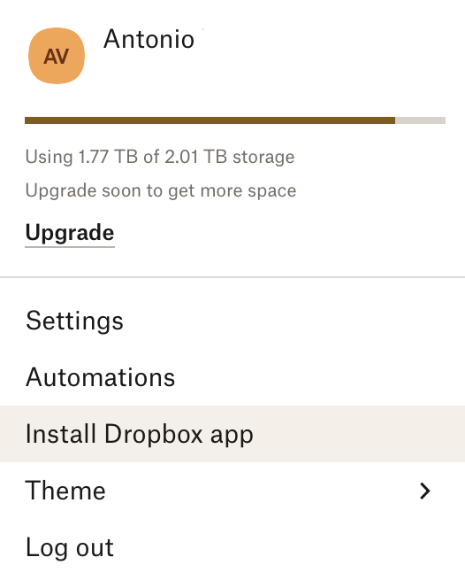
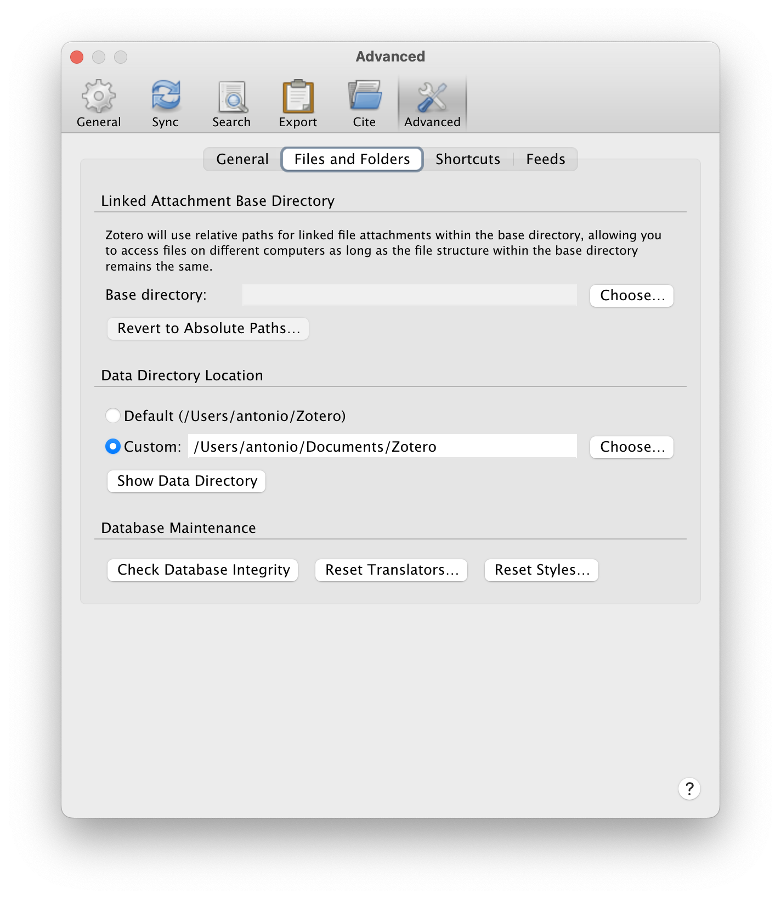
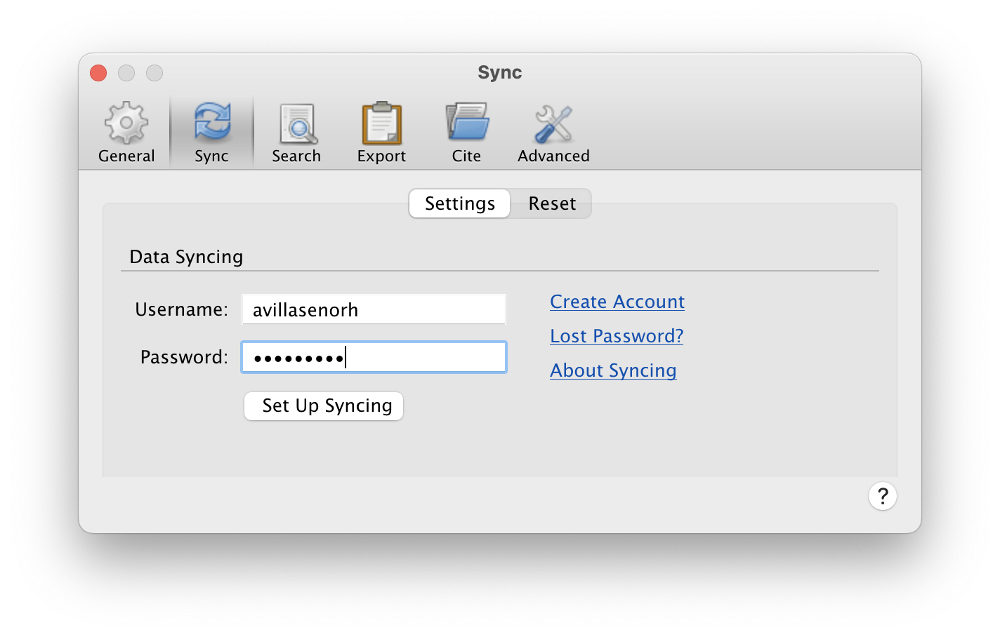
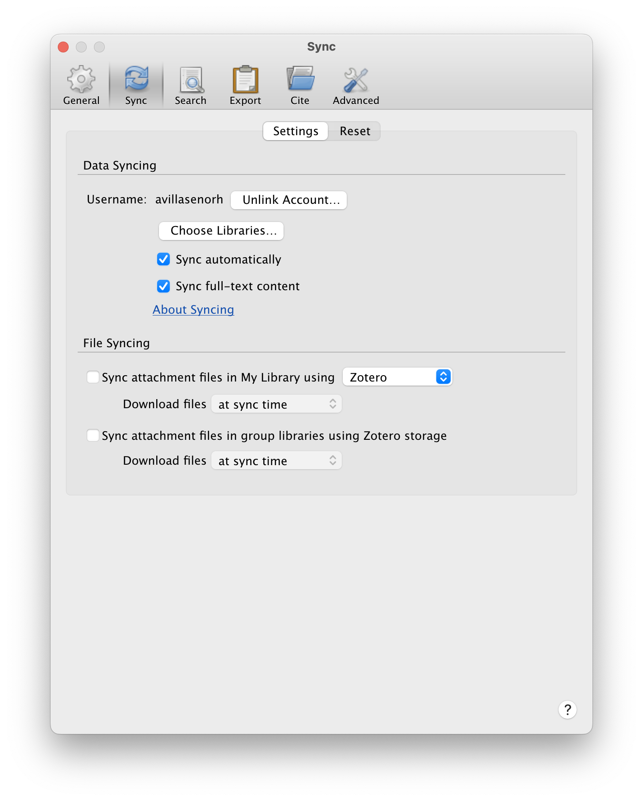

## Fresh macOS Sonoma installation


### 1. Inmediately after installation

First check if there are updates for the operating system.

Remove from Dock unwanted applications.

#### Change setting for macOS and applications

- Change System settings

    - Dock > Position on screen: Left
    - Dock > Minimize windows into application icon
    - Mouse > Secondary click (Click on right side)
    - General > Language & Region > Number format: change decimal character to "."

- Change Finder settings

    - General > New Finder window show: Desktop

    - Sidebar > Show Hard disks (add HDD to sidebar and hide Hard disks again)
    - Sidebar > Do not show CDs, DVDs, and iPods
    - Sidebar > Sidebar: remove not used

    - Advanced > Show all filename extensions
    - Advanced > Do not show warning changing extensions
    - Advanced > Keep folders on top when sorting by name

- Change Safari settings

    - General > uncheck "Open safe files after downloading"

- Change Textedit settings

    - TextEdit > Format > Make Plain Text


- Remove Floating Thumbnail from Screen Shot:

Cmd + Shift + 5 > Options > Show Floating Thumbnail (uncheck)

#### Install iTerm2

Dowload and install the [iTerm2](https://iterm2.com) app and use it instead of the default terminal

In Settings > Profiles > Colors, change color preset to *Novel*. (The file `Novel.itermcolors`
can be found in `~/Dropbox/Software/macOS/macOS_setup/itermcolors`)

#### Set default shell to `bash`

Because of license issues, in the latest versions of macOS the default shell is `zsh` instead of `bash`.
To change the default shell to `bash`:

    $ chsh -s /bin/bash

Initially (before creating/modifying the `.bash_profile` and `.bashrc` files)
the `$PATH` environmental variable is set to:

    /usr/local/bin
    /System/Cryptexes/App/usr/bin
    /usr/bin:/bin:/usr/sbin:/sbin
    /var/run/com.apple.security.cryptexd/codex.system/bootstrap/usr/local/bin
    /var/run/com.apple.security.cryptexd/codex.system/bootstrap/usr/bin
    /var/run/com.apple.security.cryptexd/codex.system/bootstrap/usr/appleinternal/bin

After removing the **cryptex** directories, the remaining path is:

    /usr/local/bin:/usr/bin:/bin:/usr/sbin:/sbin

Because of those license issues, the version of `bash` provided in `/bin/bash`
is very old (3.2, from 2007!)

```
$ echo $BASH_VERSION
3.2.57(1)-release

$ /bin/bash --version
GNU bash, version 3.2.57(1)-release (arm64-apple-darwin23)
Copyright (C) 2007 Free Software Foundation, Inc.
```

Once you install MacPorts and a few packages, a newer version of `bash` will be available in 
`/opt/local/bin/bash`:

#### Configure Mail accounts

Add CSIC, GMail and Yahoo! mail.

Remove iCloud account to avoid confusion.

### 2. Install development packages

#### `XCode`

Go to the App Store and install **XCode**. Once it is installed, open it and it will install the
**Command line tools**. If the tools are not installed automatically it can be done from the command line:

```
$ xcode-select --install         # agree to license

$ cc --version
Apple clang version 15.0.0 (clang-1500.1.0.2.5)
Target: arm64-apple-darwin23.1.0
Thread model: posix
InstalledDir: /Applications/Xcode.app/Contents/Developer/Toolchains/XcodeDefault.xctoolchain/usr/bin
```

NOTE: The following may not apply to Sonoma (macOS 14).

After the installation of **XCode**, the `$PATH` variable is expanded to:

    /usr/local/bin:/usr/bin:/bin:/usr/sbin:/sbin:/Library/Apple/usr/bin

The last folder contains a single command called `rvictl` that is installed by **Xcode**.

#### `XQuartz`

Then install [XQuartz](https://www.xquartz.org) for X Window support.

Logout after the installation of **XQuartz** and login again for changes to take place.

#### GCC C/C++ and Fortran compilers

Install `gcc` and `gfortran` compilers from the [HPC Mac OS X](http://hpc.sourceforge.net)
web page. Download the appropriate `.tar.gz` file (as of January 2024, the version for Sonoma
M1/M2 Apple silicon was included in the compressed tar file `gcc-13.2-m1-bin.tar.gz`)

To install it, simply type:

```
$ sudo tar xvf gcc-13.2-m1-bin.tar -C /.

$ gcc --version
gcc (GCC) 13.2.0
Copyright (C) 2023 Free Software Foundation, Inc.
...

$ gfortran --version
GNU Fortran (GCC) 13.2.0
Copyright (C) 2023 Free Software Foundation, Inc.
...
```

#### Setup dotfiles

At this point it is convenient to setup the `.bash_profile` and `.bashrc` files.
Initially `.bash_profile` contains simply:

```
#
if [ -f ~/.bashrc ]; then
	. ~/.bashrc
fi
```

**Important**: unlike in Linux, in macOS all the new terminals are login terminals, so they 
all run `.bash_profile`.

Examples of dotfiles can be found in `~/Dropbox/Software/macOS/macOS_setup/dotfiles`.

#### `MacPorts`

Now we can install the [MacPorts](https://www.macports.org) package manager. Download the
corresponding `pkg` file and run the installation.

This adds the following lines to the `.bash_profile` file:

```
# MacPorts Installer addition on 2023-12-04_at_19:25:05: adding an appropriate PATH variable for use with MacPorts.
export PATH="/opt/local/bin:/opt/local/sbin:$PATH"
# Finished adapting your PATH environment variable for use with MacPorts.
```

These lines could be removed from `.bash_profile` and added to the `$PATH` declaration in `.bashrc`.

After installation update `MacPorts`:

    $ sudo port -v selfupdate
    $ sudo port upgrade outdated

Normally after a new installation there is nothing to upgrade, but it is advisable to run
these two commands periodically.

Now we can use `MacPorts` to install a more recent version of `bash`:

    $ sudo port install bash

We can now change the default outdated `bash` to the newer version `/opt/local/bin/bash`.
To make this new `bash` the default, add `/opt/local/bin/bash` to the `/etc/shells` file:

```
$ sudo vi /etc/shells

$ cat /etc/shells
# List of acceptable shells for chpass(1).
# Ftpd will not allow users to connect who are not using
# one of these shells.

/bin/bash
/opt/local/bin/bash
/bin/csh
/bin/dash
/bin/ksh
/bin/sh
/bin/tcsh
/bin/zsh
```

and then:

    $ chsh -s /opt/local/bin/bash

To use this shell in shell scripts, replace the common shebang `#!/bin/bash` for:

    #!/usr/bin/env bash

Packages to install with MacPorts:

- `htop`
- `tree`
- `wget`
- `curl`
- `coreutils`: GNU versions of `date`, `od`, ...
- `inetutils`: `ftp`, `telnet`, ...
- `gv`
- `a2ps`
- `ImageMagick`
- `GraphicsMagick`
- `feh`
- `openssh`
- `ffmepg`
- `parallel`

#### Python

See specific section.

Installing the PSF Python adds the following lines to `.bash_profile`:

```
# Setting PATH for Python 3.10
# The original version is saved in .bash_profile.pysave
PATH="/Library/Frameworks/Python.framework/Versions/3.10/bin:${PATH}"
export PATH
```
The resulting `$PATH` looks like:

    /Library/Frameworks/Python.framework/Versions/3.10/bin:/opt/local/bin:/opt/local/sbin:/usr/local/bin:/usr/bin:/bin:/usr/sbin:/sbin:/opt/X11/bin:/Library/Apple/usr/bin

Installing the Anaconda Python distribution adds the following lines to `.bash_profile`

```
# >>> conda initialize >>>
# !! Contents within this block are managed by 'conda init' !!
__conda_setup="$('/Users/antonio/opt/anaconda3/bin/conda' 'shell.bash' 'hook' 2> /dev/null)"
if [ $? -eq 0 ]; then
    eval "$__conda_setup"
else
    if [ -f "/Users/antonio/opt/anaconda3/etc/profile.d/conda.sh" ]; then
        . "/Users/antonio/opt/anaconda3/etc/profile.d/conda.sh"
    else
        export PATH="/Users/antonio/opt/anaconda3/bin:$PATH"
    fi
fi
unset __conda_setup
# <<< conda initialize <<<
```

And sets the `$PATH` variable to:

    /Users/antonio/opt/anaconda3/bin:/Users/antonio/opt/anaconda3/condabin:/Library/Frameworks/Python.framework/Versions/3.10/bin:/opt/local/bin:/opt/local/sbin:/usr/local/bin:/usr/bin:/bin:/usr/sbin:/sbin:/opt/X11/bin:/Library/Apple/usr/bin

However, this initializes the **conda** `base` environment for each new shell opened. To prevent this:

    $ conda config --set auto_activate_base false

This creates a file `.condarc` with the following content:

    auto_activate_base: false

Now when opening a new shell the **conda** `base` environment is not activated, and the
`$PATH` variable is set to:

    /Users/antonio/opt/anaconda3/condabin:/Library/Frameworks/Python.framework/Versions/3.10/bin:/opt/local/bin:/opt/local/sbin:/usr/local/bin:/usr/bin:/bin:/usr/sbin:/sbin:/opt/X11/bin:/Library/Apple/usr/bin

This means that the PSF Python takes preference over the Anaconda Python. To change this,
simply activate a **conda** environment:

    $ conda activate         # activates the base environment
    $ conda activate seismo  # activates the "seismo" environment

#### Git and GitHub

Probably at this point `git` is already installed by **MacPorts**. If that is not the case
go to the Git [web page](https://www.git-scm.com) and download the installer for macOS.

To configure Git:

    $ git config --global user.name "Antonio Villasenor"
    $ git config --global user.email "antonio.villasenor@csic.es"
    $ git config --global color.ui true

In order to pull and push repositories from your GitHub account in the past it was necessary
to set up a private SSH key. Now it is done with personal access tokens that are used as
passwords.


#### Julia


#### Java

Download a macOS Arm 64 DMG installer of the Java SE (standard edition) Development Kit (JDK).
For version 21.0 use the following [download page](https://www.oracle.com/java/technologies/javase/jdk21-archive-downloads.html).

#### Virtualization

- Docker
- VirtualBox
- Vagrant

### 3. Seismological software

#### SAC

Obtain the **SAC** distribution from IRIS as a tar file with the codes precompiled for macOS.
As of 2024-01-20 the latest version of **SAC** is 102.0 provided in the tar file `sac-102.0-mac.tar`.

    $ cd /usr/local
    $ sudo tar xvf .../sac-102.0-mac.tar

Then define the following variables in `.bashrc`

    export SACHOME=/usr/local/sac
    export SACAUX=$SACHOME/aux
    export SACLIB=$SACHOME/lib/sacio.a
    export SAC_DISPLAY_COPYRIGHT=0
    export SAC_USE_DATABASE=0
    export SAC_PPK_LARGE_CROSSHAIRS=1

And finally add `$SACHOME/bin` to the `PATH` variable.


#### SEISAN

Download the latest version from the [SEISAN web site](https://www.seisan.info).
As of 2024-01-20 the latest version of SEISAN is 13.03, but it is not available yet
for macOS, so we will install the previous version (12.0 from May 2021).

First create a directory for **SEISAN**. A typical name would be `/seismo`.
However the most recent macOS versions do not allow to create a directory directly under the root
directory, so an alternative can be `$HOME/seismo`.

    $ cd 
    $ mkdir seismo
    $ cd seismo
    $ tar xvzf .../seisan_v12.0_macosx_64.tar.gz
    $ cd COM
    $ vi SEISAN.bash

Edit `SEISAN.bash` and modify the following lines:

    export SEISARCH="macosx"              # only needed to recompile SEISAN
    export SEISAN_TOP="${HOME}/seismo"

Edit `.bashrc` and add the following lines:

    export SEISAN=${HOME}/seismo
    source $SEISAN/COM/SEISAN.bash

You can also here add `$SEISAN_TOP/PRO` and `$SEISAN_TOP` to the `PATH`.
In this case you can comment the following lines in `SEISAN.bash`:

    #export PATH="$SEISAN_TOP/PRO:$PATH"
    #export PATH="$SEISAN_TOP/COM:$PATH"

This version of **SEISAN** (12.0) comes precompiled for Macs with Intel processors.
To recompile it for M1/M2 chips you need first to modify the `Makefile` files in
`$SEISAN_TOP/LIB` and `$SEISAN_TOP/PRO` and repace the `gcc-11`compiler for simply `gcc`.

In `$SEISAN_TOP/LIB`:

    #cc_macosx    = gcc-11 -m64 -c -I../INC -I/usr/X11R6/include $(debug_flags) -o $@
    cc_macosx    = gcc -m64 -c -I../INC -I/usr/X11R6/include $(debug_flags) -o $@

In `$SEISAN_TOP/PRO`:

    #cc_macosx     = gcc-11 -m64 -I../INC $(debug_flags) -o $@
    cc_macosx     = gcc -m64 -I../INC $(debug_flags) -o $@

After these changes type:

    $ cd $SEISAN_TOP/PRO
    $ make clean
    $ make all

This will recompile the **SEISAN** library in `$SEISAN_TOP/LIB` and all the executables
in `$SEISAN_TOP/PRO`


#### CPS

To install Bob Herrmann's Computer Programs in Seismology first you need to get a tar
file with the latest version. At the time of this writing the most recent version
was `NP330.Oct-26-2023.tgz`.

To compile the codes:

    $ cd 
    $ cd src
    $ tar xvzf .../NP330.*DATE*.tgz
    $ cd PROGRAMS.330
    $ ./Setup OSXM                       # use this option for M1/M2 chips
    $ ./C > compile.log 2>&1 &
    $ tail -f compile.log

The executables will be located in `$HOME/src/PROGRAMS.330/bin`. You need to add this
directory to your `PATH`.


#### ObsPy

The easiest way to install **ObsPy** is via Anaconda:

    $ conda create -n obspy python=3.11 obspy cartopy pytest pytest-json
    $ conda activate obspy
    $ (obspy) conda install pytest pytest-json-report   # this is necessary to run the tests
    $ (obspy) obspy-runtests

#### Pyrocko

    $ conda create -n pyrocko python=3.11
    $ conda activate pyrocko
    $ (pyrocko) conda install -c pyrocko pyrocko

#### PhaseNet

    $ git clone https://github.com/AI4EPS/PhaseNet.git
    $ cd PhaseNet
    $ conda env create -f env.yml
    $ conda activate phasenet

#### IRIS/SAGE Software

Compile the library `libmseed` and associated codes (`dataselect`, `mseed2sac`, `msi`, `msmod`)

The miniSEED utilities can be installed by compiling the source code in `src/mstools`

    $ cd
    $ cd src/mstools
    $ mkdir -p ~/bin                      # if it does not exist
    $ mkdir -p ~/man/man1                 # if it does not exist
    $ ./compile_all.sh > compile.log 2>&1

Newer versions of the codes are also available on GitHub

```
https://github.com/EarthScope/libmseed
https://github.com/EarthScope/dataselect
https://github.com/EarthScope/msi
https://github.com/EarthScope/msmod
https://github.com/EarthScope/mseed2sac
https://github.com/EarthScope/sac2mseed

https://github.com/EarthScope/evalresp
https://github.com/EarthScope/fdsn-stationxml-convertor

https://github.com/EarthScope/ispaq 
```

- `evalresp`
- `JEvalResp`
- `JPlotResp`
- `rdseed`
- `TauP`


#### NonLinLoc

    $ git clone https://github.com/alomax/NonLinLoc.git
    $ cd NonLinLoc/src
    $ /bin/rm -rf bin
    $ mkdir bin
    $ rm CMakeCache.txt
    $ cmake .
    $ make > make.log 2>&1

If compilation of `sphfd_SWR_NLL` fails, comment the following lines in `CMakeLists.txt`

    # --------------------------------------------------------------------------
    # sphfd_SWR_NLL
    #
    #add_executable(sphfd_SWR_NLL sphfd_SWR_NLL.c)
    #target_link_libraries(sphfd_SWR_NLL GRID_LIB_OBJS m)
    #target_compile_options(sphfd_SWR_NLL PRIVATE "-w")

And recompile:

    $ /bin/rm -rf bin
    $ mkdir bin
    $ rm CMakeCache.txt
    $ cmake .
    $ make > make.log 2>&1


#### PASSCAL PASSOFT Software

PASSCAL PASSOFT [web page](https://www.passcal.nmt.edu/content/software-resources).

List of PASSOFT applications [link](https://www.passcal.nmt.edu/content/list-passoft-applications)

Includes `dataselect`, `msi`, and `rdseed`.


Installation:

     $ conda create -n passoft3 passoft -c https://onyx.passcal.nmt.edu/passcal -c conda-forge
     $ conda update passoft -c https://onyx.passcal.nmt.edu/passcal -c conda-forge
     $ conda activate passoft3

     $ conda create -n viewer viewer -c https://onyx.passcal.nmt.edu/passcal -c conda-forge
     $ conda activate viewer


#### Seismic Unix

Download the most recent distribution from the Seismic Unix [WIKI](https://wiki.seismic-unix.org/start).

Uncompress the tar file in `/usr/local/cwp`.

    $ cd /usr/local
    $ sudo mkdir cwp
    $ cd cwp
    $ tar xvzf cwp_su_all_4XRXX.tgz

Set the following variable in `.bashrc`.

    export CWPROOT=/usr/local/cwp

Add `$CWPROOT/bin` to the `PATH`.

    $ cd $CWPROOT/src/configs
    $ cp Makefile.config_macos ../Makefile.config
    $ cd ..
    $ make install
    $ make xtinstall

Additional items (not essential for running most of SU)

    $ make xminstall    # for FFTLAB, a fun educational app for exploring the Fourier Transform
    $ make mglinstall   # Open GL applications, Graphics codes that could be built upon.
    $ make finstall     # Fortran codes, modeling and anisotropy codes.
    $ make sfinstall    # SFIO installation for segdread (the SEGD to SU data reader)


#### Educational

jAmaSeis

### 4. Geoscience software

#### GMT

GMT6 can be installed with **MacPorts**:

    $ sudo port install gdal +hdf5 +netcdf +openjpeg
    $ sudo port install gmt6 [+fftw3]

    $ sudo port install graphicsmagick ffmpeg         # if not installed previously

GMT is installed in `/opt/local/lib/gmt6/bin`. To use GMT in command line or scripts you
need to add this directory to your `PATH`.

#### QGIS


#### Paraview

#### GPlates

### 5. Other software

#### Rosetta 2

Rosetta 2 enables a Mac with Apple silicon to use apps built for a Mac with
an Intel processor [[link]](https://support.apple.com/en-us/HT211861).
Rosetta 2 is automatically installed the first time that we try to use
an app that was built only for Mac computers with an Intel processor.

#### Dropbox

First login to your Dropbox account and click on **Install Dropbox app**
to download the installer. 

{ width="250" style="display: block; margin: 0 auto" }

Run the installer and select the folders that you want to synchronize.
These folders will be created under the directory `$HOME/Dropbox`

Make soft links to the folders that you want to access in your `$HOME` directory:

    $ cd
    $ ln -s ~/Dropbox/Projects
    $ ln -s ~/Dropbox/src
    $ ln -s ~/Dropbox/scripts
    $ ln -s ~/Dropbox/data

Finally remove the original `Documents` folder from the **Finder** sidebar
and add replace it with `~/Dropbox/Documents`. Also add to the sidebar commonly
used folders such as `~/Dropbox/Projects`, etc.

#### Zotero

Download the appropriate installer from the [Zotero web page](https://www.zotero.org).

By default, Zotero stores its files in `$HOME/Zotero`. If you want to change this location
to for example `$HOME/Documents/Zotero`, go to **Preferences > Advanced > Files and Folders**
and change the directory where the Zotero files are stored:



To synchronize your Zotero library between computers, you need to create a Zotero
account and enable syncing.
Go to **Preferences > Sync** and enter username and password of your Zotero account
and click on **Set Up Syncing**.



After that some additional options will appear.
**Uncheck** the two boxes in the **File Syncing** section.



The synchronization of a large PDF collection requires a paid Zotero subscription.
However, the synchronization can be done with other shared folders such as Dropbox.

In your first installation of Zotero, store the PDFs in a shared Dropbox
location instead of the Zotero folder:

1. Quit Dropbox
2. Go to local Zotero directory (e.g. `$HOME/Documents/Zotero`) 
3. Copy the `storage` folder to `$HOME/Dropbox/Zotero/storage`
4. Rename directory `storage` to `storage_old`
5. Make a soft link of Dropox storage directory `$HOME/Dropbox/Zotero/storage` 
   to the current directory
6. Restart Zotero

The commands to enter in the terminal are:

    $ cd
    $ mkdir -p ~/Dropbox/Zotero
    $ cd Documents/Zotero
    $ cp -r storage ~/Dropbox/Zotero/.
    $ mv storage storage_old
    $ ln -s ~/Dropbox/Zotero/storage

If you already have a shared Zotero Dropbox folder, you can access it
and synchronize it from other computers.

1. Install Zotero and optionally change the Zotero folder to `$HOME/Documents/Zotero`
2. Login to your Zotero account, uncheck the **File Syncing** options and wait for the
   synchronization of all papers (this synchronizes only the metadata, not the PDFs)
3. Quit Zotero
4. Go to local Zotero directory (e.g. `$HOME/Documents/Zotero`) 
5. Rename directory `storage` to `storage_old`
6. Make a soft link of Dropox storage directory `$HOME/Dropbox/Zotero/storage` 
   to the current directory
6. Restart Zotero

The commands to enter in the terminal are:

    $ cd
    $ cd Documents/Zotero
    $ mv storage storage_old
    $ ln -s ~/Dropbox/Zotero/storage

#### Microsoft Office

Log in to **Microsoft 365** account to download installer.

Remove unwanted applications (e.g. Outlook, OneNote) just after installation.

#### MacTeX and TeXstudio

To install LaTeX in a Mac, the best alternative is to install the [MacTeX](https://www.tug.org/mactex/)
distribution. Download and run the `pkg` installer (it is a large download).

Once you have installed MacTeX you can also install the [TeXstudio](https://www.texstudio.org)
integrated writing environment for creating LaTeX documents. Download the `dmg` installer,
open it and copy the app to the `Applications` folder.

#### Miscellaneous

The following apps can be installed from the App Store:

- **The Unarchiver**: open compressed files
- **Pocket**: save web articles to read later
- **Simple Comic**: comic reader for `cbz` and `cbr` formats

The following apps can be installed by downloading the installer from the developer's web page:

- **Adobe Acrobat Reader**: for reading and digitally sign PDF documents
- **Brave**: web browser
- **Firefox**: web browser
- **Tor**: web browser
- **Google Earth Pro**: map and satellite imagery viewer ([download](https://www.google.com/earth/about/versions/))
- **Spotify**: listen to music and podcasts
- **qBittorrent**: download torrent files
- **VLC**: video and music player
- **zoom**: video conference tool

- **DjView**: visualize scanned documents in `djvu` format ([link](https://djvu.sourceforge.net/djview4.html))
