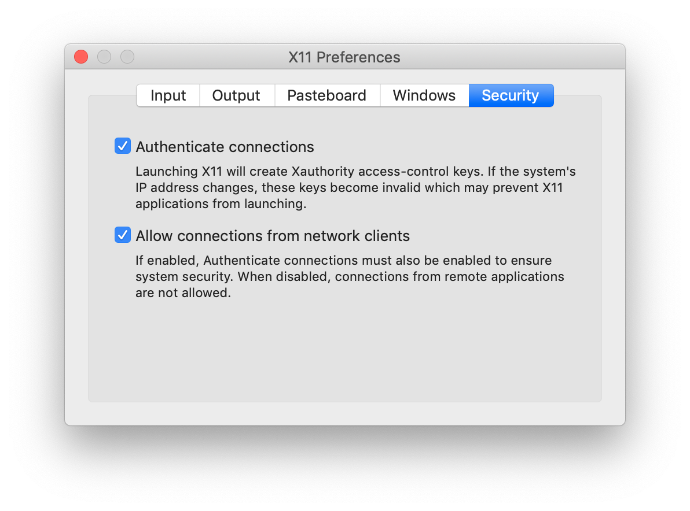

# Docker

Install Docker Desktop.

Download dmg and install.

Run tutorial:

    $ cd
    $ mkdir Docker
    $ cd Docker
    $ git clone https://github.com/docker/getting-started.git
    $ cd getting-started
    $ docker build -t docker101tutorial .
    $ docker run -d -p 80:80 --name docker-tutorial docker101tutorial
    $ docker tag docker101tutorial avillasenorh/docker101tutorial
    $ docker push avillasenorh/docker101tutorial

Login to [dockerhub](https://hub.docker.com)

Docker course/book

    $ git clone https://github.com/docker/doodle.git

    $ cd doodle/cheers2019 && docker build -t avillasenorh/cheers2019 .

    $ docker run -it --rm avillasenorh/cheers2019

    $ docker login && docker push avillasenorh/cheers2019


    $ docker version
    ...

    $ docker --version
    $ docker-compose --version
    $ docker-machine --version
    $ notary version

    $ docker image ls
    REPOSITORY                TAG                 IMAGE ID            CREATED             SIZE
    avillasenorh/cheers2019   latest              415686aae5f6        4 days ago          4.01MB
    <none>                    <none>              7702daeafbab        4 days ago          356MB
    golang                    1.11-alpine         e116d2efa2ab        3 months ago        312MB

```console
$ docker system info
Client:
 Debug Mode: false

Server:
 Containers: 0
  Running: 0
  Paused: 0
  Stopped: 0
 Images: 8
 Server Version: 19.03.4
 Storage Driver: overlay2         !!!!!!!!! storage driver used (good for Ubuntu, RH >= 4.x)
  Backing Filesystem: extfs
  Supports d_type: true
  Native Overlay Diff: true
 Logging Driver: json-file
 Cgroup Driver: cgroupfs
 Plugins:
  Volume: local
  Network: bridge host ipvlan macvlan null overlay
  Log: awslogs fluentd gcplogs gelf journald json-file local logentries splunk syslog
 Swarm: inactive
 Runtimes: runc
 Default Runtime: runc
 Init Binary: docker-init
 containerd version: b34a5c8af56e510852c35414db4c1f4fa6172339
 runc version: 3e425f80a8c931f88e6d94a8c831b9d5aa481657
 init version: fec3683
 Security Options:
  seccomp
   Profile: default
 Kernel Version: 4.9.184-linuxkit
 Operating System: Docker Desktop
 OSType: linux
 Architecture: x86_64
 CPUs: 2
 Total Memory: 1.952GiB
 Name: docker-desktop
 ID: HN4Y:T3NM:PXHK:Y6X5:XW7H:ZFCX:FPUS:5BZZ:KLER:24WB:6EFH:B6BS
 Docker Root Dir: /var/lib/docker
 Debug Mode: true
  File Descriptors: 30
  Goroutines: 46
  System Time: 2019-11-21T10:47:33.8906462Z
  EventsListeners: 2
 HTTP Proxy: gateway.docker.internal:3128
 HTTPS Proxy: gateway.docker.internal:3129
 Registry: https://index.docker.io/v1/
 Labels:
 Experimental: false
 Insecure Registries:
  127.0.0.0/8
 Live Restore Enabled: false
 Product License: Community Engine
```

    $ docker pull ubuntu:latest
    latest: Pulling from library/ubuntu
    7ddbc47eeb70: Pull complete
    c1bbdc448b72: Pull complete
    8c3b70e39044: Pull complete
    45d437916d57: Pull complete
    Digest: sha256:6e9f67fa63b0323e9a1e587fd71c561ba48a034504fb804fd26fd8800039835d
    Status: Downloaded newer image for ubuntu:latest
    docker.io/library/ubuntu:latest

    $ docker image ls
    REPOSITORY                TAG                 IMAGE ID            CREATED             SIZE
    avillasenorh/cheers2019   latest              415686aae5f6        4 days ago          4.01MB
    <none>                    <none>              7702daeafbab        4 days ago          356MB
    ubuntu                    latest              775349758637        2 weeks ago         64.2MB
    golang                    1.11-alpine         e116d2efa2ab        3 months ago        312MB


    $ docker container run -it ubuntu:latest /bin/bash
    root@dc672cdb77cc:/# ps -elf
    F S UID        PID  PPID  C PRI  NI ADDR SZ WCHAN  STIME TTY          TIME CMD
    4 S root         1     0  0  80   0 -  4626 -      11:01 pts/0    00:00:00 /bin/bash
    0 R root        13     1  0  80   0 -  8599 -      11:05 pts/0    00:00:00 ps -elf

-it flag switchs your shell into the terminal of the container

control + P + Q (p and q in sequence, not simultaneously): exits the container without terminating it (back to shell of host machine)

    $ docker container ls # shows processes running inside container
    CONTAINER ID        IMAGE               COMMAND             CREATED             STATUS              PORTS               NAMES
    dc672cdb77cc        ubuntu:latest       "/bin/bash"         8 minutes ago       Up 8 minutes                            trusting_chandrasekhar

To enter again:

    $ docker container exec -it trusting_chandrasekhar bash
    root@dc672cdb77cc:/# ps -elf
    F S UID        PID  PPID  C PRI  NI ADDR SZ WCHAN  STIME TTY          TIME CMD
    4 S root         1     0  0  80   0 -  4626 -      11:01 pts/0    00:00:00 /bin/bash
    4 S root        14     0  0  80   0 -  4626 -      11:14 pts/1    00:00:00 bash
    0 R root        23    14  0  80   0 -  8599 -      11:14 pts/1    00:00:00 ps -elf

control + P + Q again

To stop container:

    $ docker container stop trusting_chandrasekhar
    $ docker container rm trusting_chandrasekhar

    $ docker container ls -a
    CONTAINER ID        IMAGE               COMMAND             CREATED             STATUS              PORTS               NAMES


EXAMPLE

    $ git clone https://github.com/nigelpoulton/psweb.git
    $ cd psweb/
    $ cat Dockerfile
    $ docker image build -t test:latest .
    $ $ docker image ls
    REPOSITORY                TAG                 IMAGE ID            CREATED              SIZE
    test                      latest              ac4605aff0f1        About a minute ago   71.5MB
    avillasenorh/cheers2019   latest              415686aae5f6        4 days ago           4.01MB
    <none>                    <none>              7702daeafbab        4 days ago           356MB
    ubuntu                    latest              775349758637        2 weeks ago          64.2MB
    alpine                    latest              965ea09ff2eb        4 weeks ago          5.55MB
    golang                    1.11-alpine         e116d2efa2ab        3 months ago         312MB

    $ docker container run -d --name web1 --publish 8080:8080 test:latest

## X-windows applications in Docker

Example of how to create an image with `Firefox` and send the display to
macOS host running X-windows:

`Dockerfile`:

```
FROM ubuntu:latest
RUN apt-get update && \
    apt-get install firefox -y
CMD /usr/bin/firefox
```

To create the Docker image named `myfirefox` from the `Dockerfile`, go to the
directory of the `Dockerfile` and type:

```console
$ docker build -t myfirefox .
```


Set "Allow connections from network clients" in `XQuartz` Preferences (Security tab):



(Probably you need to logout and login again to activate changes)

How to run:

```console
$ xhost + 127.0.0.1         # authorize connetions only from localhost (also known as loopback address)
$ docker run --rm -d -e DISPLAY=host.docker.internal:0 myfirefox
```


